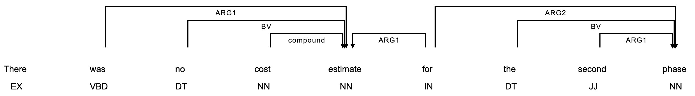

**This repository is currently in early development state.**




# PyTorch (+ AllenNLP) Reimplementation of [SPIGOT](https://arxiv.org/abs/1805.04658v1) Parser

This repo tries to reimplement a pipeline system of a syntactic-then-semantic parser,
trained end-to-end using the technique called "SPIGOT", proposed in ACL2018 paper
[Backpropagating through Structured Argmax using a SPIGOT](https://arxiv.org/abs/1805.04658v1) by Peng et al.


## [SemEval 2015](http://alt.qcri.org/semeval2015/task18/) Broad-Coverage Semantic Dependency Parsing

The dataset is available at [LDC](https://catalog.ldc.upenn.edu/LDC2016T10).

## Running the code

Please refer to `requirements.txt` for the versions of libraries used in the reproduction.

```sh
$ pip install torch allennlp allennlp-models
$ git clone https://github.com/masashi-y/allennlp_spigot
```

For the SemEval datasets, please use the script in the `semeval2015_data` directory to preprocess
(I borrowed this from the [NeurboParser](https://github.com/Noahs-ARK/NeurboParser) repo and modified so it works with Python 3).
This will create the train/dev/test split files for the respective semantic dependency types, named such as `english_id_dm_augmented_test.sdp` (english, in-domain, DM-formalism, augmented with syntactic dependencies, test split).


For training, first configure paths in `configs/syntactic_then_semantic_dependencies.jsonnet`, and then (in the `allennlp_spigot` directory):

```sh
$ allennlp train --include-package spigot --serialization-dir results configs/syntactic_then_semantic_dependencies.jsonnet
```

For prediction,

when using a \*.sdp file as input and use the annotated POS tags:
```sh
$ allennlp predict --use-dataset-reader --predictor semantic_dependencies_predictor --include-package spigot --silent --output-file system.sdp results/model.tar.gz english_id_dm_augmented_test.sdp
```

when using raw texts an input and use POS tags predicted by a spaCy model (default: `en_core_web_sm`):
```sh
$ cat input.jsonl
{"sentence": "this is an example sentence."}
$ allennlp predict --predictor semantic_dependencies_predictor --include-package spigot --silent --output-file system.sdp results/model.tar.gz input.jsonl
```

## Results

(from their paper)

|Model| - | - |
|:---:|:---:|:---:|
|-| - | - |
|-| - | - |

(reproduced result by me)

|Model| - | - |
|:---:|:---:|:---:|
|-| - | - |
|-| - | - |

## Differences between the original and this implementations

- The use of AD3 for decoding semantic dependencies is currently future work, and this implementation just outputs edges with the probabilities more than predefined threshold (default: 0.5) and assigns the most probable tags to them.
  - As such, training is done by minimizing the negative log probabilities of these edges and labels, instead of using the SSVM loss.

## Citation Information

```
@inproceedings{peng-etal-2018-backpropagating,
    title = "Backpropagating through Structured Argmax using a {SPIGOT}",
    author = "Peng, Hao  and
      Thomson, Sam  and
      Smith, Noah A.",
    booktitle = "Proceedings of the 56th Annual Meeting of the Association for Computational Linguistics (Volume 1: Long Papers)",
    month = jul,
    year = "2018",
    address = "Melbourne, Australia",
    publisher = "Association for Computational Linguistics",
    url = "https://www.aclweb.org/anthology/P18-1173",
    doi = "10.18653/v1/P18-1173",
    pages = "1863--1873",
    abstract = "We introduce structured projection of intermediate gradients (SPIGOT), a new method for backpropagating through neural networks that include hard-decision structured predictions (e.g., parsing) in intermediate layers. SPIGOT requires no marginal inference, unlike structured attention networks and reinforcement learning-inspired solutions. Like so-called straight-through estimators, SPIGOT defines gradient-like quantities associated with intermediate nondifferentiable operations, allowing backpropagation before and after them; SPIGOT{'}s proxy aims to ensure that, after a parameter update, the intermediate structure will remain well-formed. We experiment on two structured NLP pipelines: syntactic-then-semantic dependency parsing, and semantic parsing followed by sentiment classification. We show that training with SPIGOT leads to a larger improvement on the downstream task than a modularly-trained pipeline, the straight-through estimator, and structured attention, reaching a new state of the art on semantic dependency parsing.",
}
```
